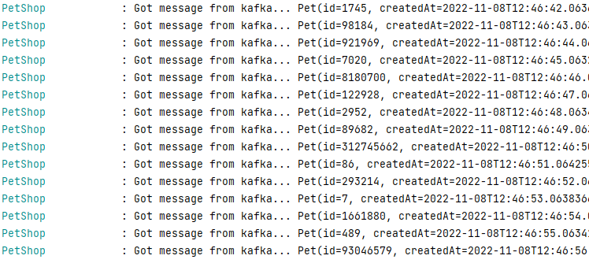

# Hello Kafka!

This repository is intended to be run during a workshop about Kafka.

# Setup

The Project is set up to teach the fundamentals of Kafka itself. You will connect to it, publish messages, make changes and see it everywhere on everyone's device.
Each step becomes a littlebit more difficult than the last. If you get lost or do not know what to do you can always ask for help and we will (try) to explain why things are happening the way they are. 
Each section has its own addition to this README.md file. Each step can be found in a separate branch. You can run the command `git branch -r` to find out all the steps that exist.

To check out a separate step you can issue the following command:

```shell
git checkout -b <branch name> origin/<branch name>
```

After such a command the new branch is visible.

If you become lost and want to reset to the beginning you can always use `git reset --hard`

To continue with this workshop fill in `git checkout origin/step-1 -b step-1`


# Step 2

### Description
The step is to create a way of serializing what you get in. We know what kind of data will be incoming.
Our task is to find out how we can make a mapping from the data towards the actual Pet instance.

Please note that the payload is `@Payload(required = false)` not required.

### Starting

We want to start by properly mapping the Object we're getting in. The object is defined as follows;
```JSMin
{
  "id" :  "9001", // The ID of the pet that is created. Is considered to be unique. The type is "Long" and is never null.
  "createdAt" :  "222022-11-07T13:34:53.975838212Z", // The most common ISO Date Time Format yyyy-MM-dd'T'HH:mm:ss.SSSXXX — for example, "2000-10-31T01:30:00.000-05:00".
  "name": "John Cena", // Name of the animal. The maximum is 50 characters, never null
  "type": "Lion", // Type of the animal like "Lynx" or "Chimpanzee". The maximum is 50 characters, never null.
  "owner": "me" // The owner of the animal. The maximum is 50 characters, nullable.
}
```
Setting up the automated mapping can be done in multiple ways.  
In this workshop we will utilize jackson from the spring-boot-starter-json. It will ensure the correct serialization of the DatetimeOffset element inside the message.

All configuration should be done inside the application.yaml file   
Hints......
```yaml
spring:
  kafka:
    consumer:

```

### Completion
If you are done the output of your run should be able to display:


