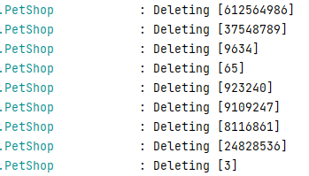

# Hello Kafka!

This repository is intended to be run during a workshop about Kafka.

# Setup

The Project is set up to teach the fundamentals of Kafka itself. You will connect to it, publish messages, make changes and see it everywhere on everyone's device.
Each step becomes a littlebit more difficult than the last. If you get lost or do not know what to do you can always ask for help and we will (try) to explain why things are happening the way they are. 
Each section has its own addition to this README.md file. Each step can be found in a separate branch. You can run the command `git branch -r` to find out all the steps that exist.

To check out a separate step you can issue the following command:

```shell
git checkout -b <branch name> origin/<branch name>
```

After such a command the new branch is visible.

If you become lost and want to reset to the beginning you can always use `git reset --hard`

To continue with this workshop fill in `git checkout origin/step-1 -b step-1`


# Step 4

### Description

Oh no.... Our kafka is storing everything! How can we ever deal with millions upon millions of rows of data... This is slowly becoming unsustainable.

To ensure we can get rid of stale messages the team as decided to prnue everything older than a few minutes.

This is done by creating a [Tombstone messages](https://kafka.apache.org/documentation/#design_compactionbasics). Creating these messages ensures that the cluster is capable of cleaning up, essentially freeing up the space.

An example of the sequence of messages in order of arrival are;

| Key            | Data                                                      |
|----------------|-----------------------------------------------------------|
| 1745           | `{ name: bla..., createdAt: 2022-11-08T15:07:23+00:00	}`  |
| 1745           | NULL                                                      |

This means the item with ID 1745 is no longer present after [log compacting](https://kafka.apache.org/documentation/#compaction) has happened.

### Starting

We want to delete Objects from the messages that we received form Kafka that contain the tombstone. This will prevent us from actually having the entire pet store in memory.

The way we can find out what is deleted instead of using the entire object is looking at the [header of the message](https://kafka.apache.org/documentation/#messages). 

We will have to adjust our code to deal with this new scenario.  
The key is inside the header named `KafkaHeaders.RECEIVED_MESSAGE_KEY` and is of type `Long`.


<details> 
  <summary>Hint...</summary>

```txt
key-deserializer
``` 
</details>


### Completion
If you are done the output of should display the deleted items:


