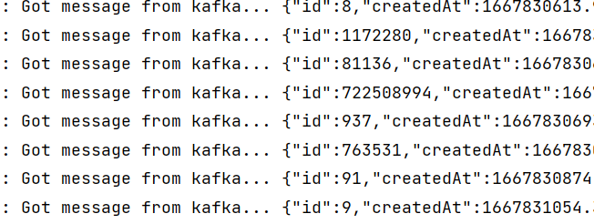

# Hello Kafka!

This repository is intended to be run during a workshop about Kafka.

# Setup

The Project is set up to teach the fundamentals of Kafka itself. You will connect to it, publish messages, make changes and see it everywhere on everyone's device.
Each step becomes a littlebit more difficult than the last. If you get lost or do not know what to do you can always ask for help and we will (try) to explain why things are happening the way they are. 
Each section has its own addition to this README.md file. Each step can be found in a separate branch. You can run the command `git branch -r` to find out all the steps that exist.

To check out a separate step you can issue the following command:

```shell
git checkout -b <branch name> origin/<branch name>
```

After such a command the new branch is visible.

If you become lost and want to reset to the beginning you can always use `git reset --hard`

To continue with this workshop fill in `git checkout origin/step-1 -b step-1`


# Step 1

### Description
The first step is to set up our Java projects. We will create a user and set up our application yaml.   
In this workshop we will utilize the "[org.springframework.kafka](https://docs.spring.io/spring-boot/docs/2.7.4/reference/htmlsingle/#messaging.kafka)" library to connect to the server.

### Starting
For your convenience a publicly available cluster has been set up. The location of the bootstrap server is located on `kafka.cluster.dissi.me:32100`.

We can get access to kafka cluster by going to the "me" page on the workshop page.    
This page automatically creates a user that connects towards the service.
  
To make sure that only _you_ can connect a username/password combination will be generated on the webpage. It ensures you can consume messages that are currently being produced.  
Configuration is done by entering the details from the "me" tab.  
Your configuration can be setup in the `src/main/resources/application.yaml` file.


### Completion
If you are done the output of your run should be able to display:



