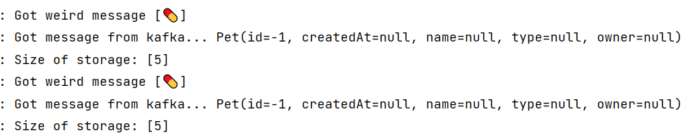

# Hello Kafka!

This repository is intended to be run during a workshop about Kafka.

# Setup

The Project is set up to teach the fundamentals of Kafka itself. You will connect to it, publish messages, make changes and see it everywhere on everyone's device.
Each step becomes a littlebit more difficult than the last. If you get lost or do not know what to do you can always ask for help and we will (try) to explain why things are happening the way they are. 
Each section has its own addition to this README.md file. Each step can be found in a separate branch. You can run the command `git branch -r` to find out all the steps that exist.

To check out a separate step you can issue the following command:

```shell
git checkout -b <branch name> origin/<branch name>
```

After such a command the new branch is visible.

If you become lost and want to reset to the beginning you can always use `git reset --hard`

To continue with this workshop fill in `git checkout origin/step-1 -b step-1`


# Step 5

### Description

Now we finally have proper cleanup available the end-users want to also have a new update to the actual service.  
We want to be smart as we are too lazy to create a proper API for it and use the CLI to generate a new message.... But we accidentally got a wrong JSON format during pasting.

### Starting

The service was running fine. It now starts to break down as we can no longer properly handle errors.  
You frantically try to fix the service quickly but also end up corrupting both the key and the value of the message.

<details> 
  <summary>Hint...</summary>

```txt
Function<FailedDeserializationInfo, Pet>
ErrorHandlingDeserializer...
properties:
  spring.deserializer.key.delegate.class
``` 
</details>


### Completion

Once we add error handling we should be able to see the error and fix it.

