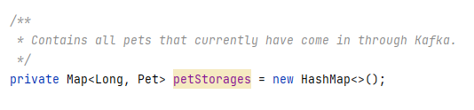

# Hello Kafka!

This repository is intended to be run during a workshop about Kafka.

# Setup

The Project is set up to teach the fundamentals of Kafka itself. You will connect to it, publish messages, make changes and see it everywhere on everyone's device.
Each step becomes a littlebit more difficult than the last. If you get lost or do not know what to do you can always ask for help and we will (try) to explain why things are happening the way they are. 
Each section has its own addition to this README.md file. Each step can be found in a separate branch. You can run the command `git branch -r` to find out all the steps that exist.

To check out a separate step you can issue the following command:

```shell
git checkout -b <branch name> origin/<branch name>
```

After such a command the new branch is visible.

If you become lost and want to reset to the beginning you can always use `git reset --hard`

To continue with this workshop fill in `git checkout origin/step-1 -b step-1`


# Step 3

### Description

We would also like to store the pet locally so we can do magic with it later.  
We would like to store the pet inside a Map format. The key is always unique meaning we can rely on the key in the message.

### Starting

Inside our PetShop we want to define a `Map<Long, Pet>`. This list contains the all the pets that exist.

To _also_ make sure we can re-run and actually have everything available from the beginning we also have to make sure we go back in time.

Kafka ensures that you continue consuming where you left off. Sometimes we forget to do something vital, and we have to replay all messages inside a partition.

To look back into the beginning we have to _seek_ towards this.

Hints...
```java
AbstractConsumerSeekAware
onPartitionsAssigned
```

### Completion
If you are done the output of your run should have a field containing all pets.:


