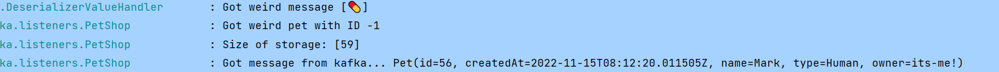

# Hello Kafka!

This repository is intended to be run during a workshop about Kafka.

# Setup

The Project is set up to teach the fundamentals of Kafka itself. You will connect to it, publish messages, make changes and see it everywhere on everyone's device.
Each step becomes a littlebit more difficult than the last. If you get lost or do not know what to do you can always ask for help and we will (try) to explain why things are happening the way they are. 
Each section has its own addition to this README.md file. Each step can be found in a separate branch. You can run the command `git branch -r` to find out all the steps that exist.

To check out a separate step you can issue the following command:

```shell
git checkout -b <branch name> origin/<branch name>
```

After such a command the new branch is visible.

If you become lost and want to reset to the beginning you can always use `git reset --hard`

To continue with this workshop fill in `git checkout origin/step-1 -b step-1`


# Step 6

### Description

We've identified the issue, but it could still occur. To make sure we can deal with the problem in the future we will have to publish a follow-up message for "fixing" the error.

### Starting

A message has to be sent towards the service that contains invalid data. To make sure we fix this we have to send a message fixing it. 

It would be wise to use a _Template_ to send the message.

We properly **trust** the message will be republished with a proper pet after this oversight.


<details> 
  <summary>Hint...</summary>

```txt
spring:
  kafka:
    producer:
      value-...
      key-....
      properties:
        spring....

KafkaT....

``` 
</details>


### Completion

Once we add error handling we should be able to see the error and publish a fixed message.

